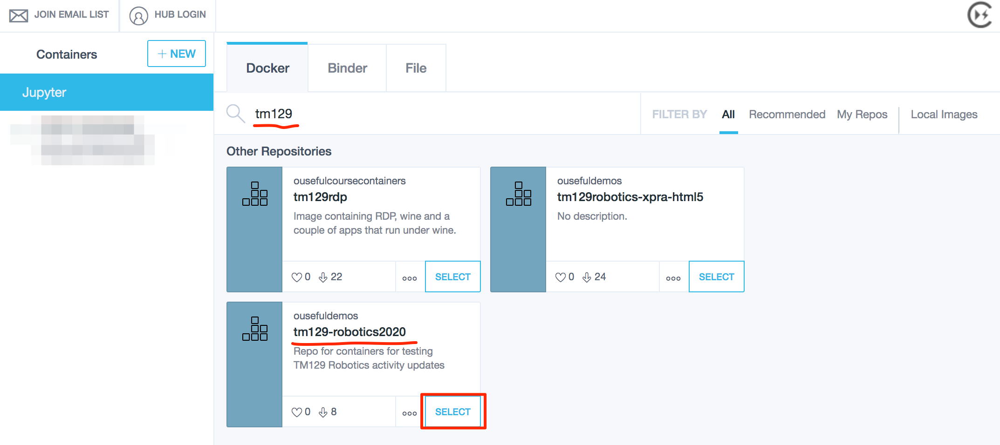
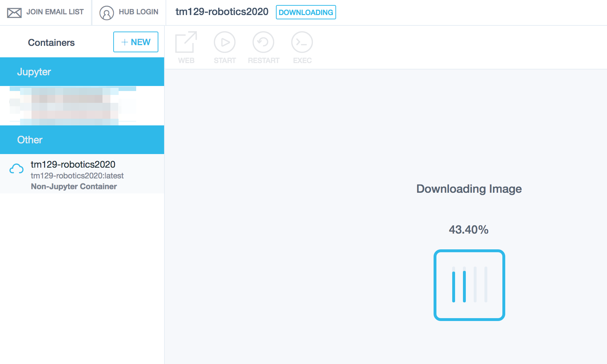

---
jupyter:
  jupytext:
    notebook_metadata_filter: rise
    text_representation:
      extension: .md
      format_name: markdown
      format_version: '1.2'
      jupytext_version: 1.4.2
  kernelspec:
    display_name: Python 3
    language: python
    name: python3
  rise:
    enable_chalkboard: true
    scroll: true
---

## Running an Open Computing Lab Environment via the ContainDS Application

__TO DO: ContainDS has moved on since this guidance was originally written. If the instructions are wrong / don't work, please comment back to [this issue](https://github.com/innovationOUtside/tm129-robotics2020/issues/6).__

*ContainDS* is a cross-platform (MacOS, Windows) desktop application that simplifies the launching and management of Docker containers in general, and Docker containers that incorporate Jupyter notebook servers in particular.

Download and install the latest version of Docker. Follow the initial guidance in the `using_docker.md` document to install docker. (You do not need to follow the guidance re: *using* Docker; the ContainDS application provides another way of doing that.)

Download and install the latest version of the ContainDS application directly from the [ContainDS website](https://containds.com/):

- __Windows__ — use *one* of the following:
  - [`exe` installer](http://containdsreleases.s3-website.us-east-2.amazonaws.com/latest/exe)
  - [`msi` installer](http://containdsreleases.s3-website.us-east-2.amazonaws.com/latest/msi)
- __MacOS__ — use *one* of the following:
  - [`pkg` installer](http://containdsreleases.s3-website.us-east-2.amazonaws.com/latest/pkg)
  - [`dmg` installer](`http://containdsreleases.s3-website.us-east-2.amazonaws.com/latest/dmg`) 
  - __Linux__: *not currently available* __TO DO: Kitematic might be a GUI fall back; or command line, which might make sense anyway.__

Alternatively, you may save the installer to your computer by right-clicking the appropriate link and choosing `Save Link As…` or `Save Target As…`.

Locate the folder containing the downloaded installer: your browser may have a `Downloads` folder, or it may have saved the downloaded file to the `My Documents` or `Desktop` folder. Inside the download folder, find the downloaded installer file and double-click it to run it.

__TO DO - could we get any security warnings?? If so, what, and how do we resolve them??__

If you saved the installer earlier, you may now delete it since it is no longer required.

The ContainDS application is a desktop application. Run it as you would any other application:

- Windows: launch the application __TO DO: how??__
- MacOS: the application will be installed into your `Applications` folder. You can launch it from there, or add the application icon the Dock to make it easier to find and launch. See also: [MacOS documentation - using the Dock](https://support.apple.com/en-gb/guide/mac-help/mh35859/mac).

### Using ContainDS to Install the Prebuilt Open Computing Lab Container Image

*Note that in this approach, you will __not__ be able to synchronise files inside the container with a persistent directory on your desktop.*

Open the ContainDS application, select the `Docker` tab and search for `tm129`. Select the `tm129-robotics2020` image.

If you have not previously downloaded the image, ContainDS will download it for you:

Do not be concerned if the download percentage indicator sometimes goes down as well as up — the downloader is actually downloading multiple items at once. (The container image is made up from several layers, each of which is downloaded separately, before they are combined in the final image.)

When everything had downloded, you may find your computer appears to be doing nothing for a minute or two, or even appears to get stuck just short of a 100% complete donwload. *Don't Panic!* The downloaded layers are all compressed files, and it may take some time for your computer to unzip them all.

Once downloaded, you will be prompted for a method of starting the container. Select "Standard":

The container will now be launched and a log trace displayed.

At this point, you need to `STOP` the container and remove it:

Now create a running version of the container from the *local* Docker image. This will allow you to share a local directory into the container as well as clicking through directly to the notebook homep[age in your browser.

### Using ContainDS To Run the Open Computing Lab Environment from a Local Docker Image

Click on the `+NEW` button and then select the `Docker` tab and then the `Local Images` tab:

`SELECT` the local copy of the `tm129-robotics2020` container which will open the container workspace configuration page:

Set the path to the directory on your host computer that you want to share into the container. This will create a `notebooks` directory in that directory that will be mapped onto the `notebooks` directory visible from the notebook homepage.

When you `CREATE` the container, it will run automatically. Clicking the `WEB` link should take you to the notebook home page in your browser. *(Note that the file listing in the screenshot may differ from the file listing you see.)*

When you save your notebooks, they will be saved into the shared directory on your own computer.

### Using ContainDS to Build and Run a RoboLab Container from Scratch

As well as running the prebuilt RoboLab container, ContainDS can also build the container image, and then launch an image from it, from scratch. (The image only needs to be built once.)

Launch the ContainDS application, and then select the `Binder` tab.

Enter the name of the source repository:

`innovationOUtside/tm129-robotics2020`

and click the `LAUNCH` button.

As the image is built, you will see several temporary containers being created and destroed along the way. Note that the build process may take some time (up to 10 minutes or more).

Once the image has been built, a running container will be launched from it.

Click on the `WEB` link and you should be taken directly to the notebook homepage in your browser without needing to provide any notebook server token yourself.

`STOP` and remove the container, and then run it from a Local Docker Image; this will allow you to share a local directory into the container and directly click through to the notebook server homepage in your browser. 
