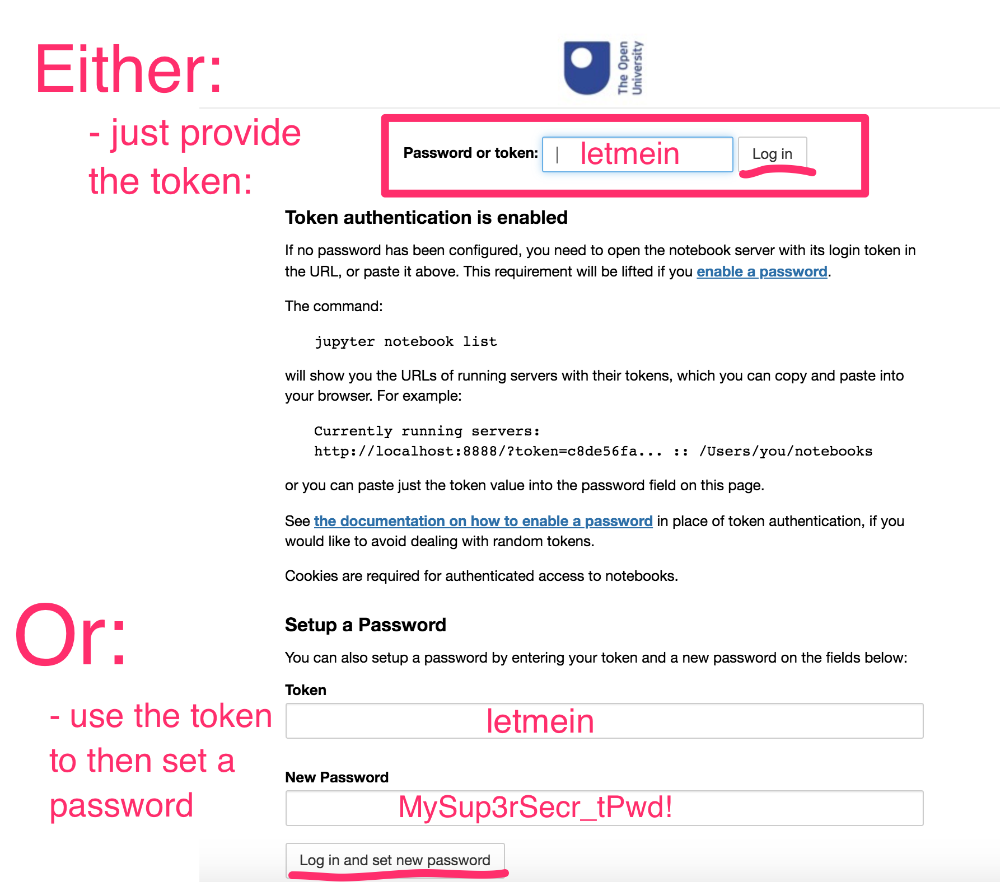

---
jupyter:
  jupytext:
    notebook_metadata_filter: rise
    text_representation:
      extension: .md
      format_name: markdown
      format_version: '1.2'
      jupytext_version: 1.4.2
  kernelspec:
    display_name: Python 3
    language: python
    name: python3
  rise:
    enable_chalkboard: true
    scroll: true
---

### Running An Open Computing Lab Environment On Your Own Computer - Computer Requirements

To run an Open Computing Lab environment on your computer, we suggest you install the prebuilt OCL environment developed for your module. For TM129, this is the prebuilt RoboLab environment. Using this environment has the advantage that the module team knows exactly what's inside it and how to help fix things if they appear to go wrong.

The downside is that the environment is quite large in terms of memory requirements: you will need at least 5GB of free memory to install it the environment, as well as its dependencies.

The underlying Docker application, which provides the virtualisation tools used to run the environment, is also happiest on computers with at least 4GB of RAM available.

### Downloading and Installing Your Open Computing Lab Environment

Open Computing Lab environments run in a simple virtual machine known as a Docker container.

To run an Open Computing Lab environment on your own computer, you will need to download and install the *Docker* application. Optionally, you may also choose the download the *ContainDS* application, which provides a graphical user interface for managing a Docker containers. If you do not download *ContainDS*, you can still control your Docker containers using command line commands issued from a terminal or command prompt.

### Download and Install Docker

Docker is the virtualisation platform that runs the RoboLab environment. You should download and install the latest version of Docker from the [Docker website](https://www.docker.com/products/docker-desktop), following the instructions for your particular operating system:

- [Docker Desktop for Windows](https://docs.docker.com/docker-for-windows/install/) ([direct download link](https://download.docker.com/win/stable/Docker%20for%20Windows%20Installer.exe)): *requires Windows 10 64-bit: Pro, Enterprise, or Education*
  - if your Windows machine does not meet the requirements for installing *Docker Desktop for Windows*, you should still be able to run Docker using the [Docker Toolbox on Windows](https://docs.docker.com/toolbox/toolbox_install_windows/)
- [Docker Desktop for Mac](https://docs.docker.com/docker-for-mac/install/) ([direct download link](https://download.docker.com/mac/stable/Docker.dmg)): *requires macOS 10.12 or newer, hardware from 2010 or newer*)
  - for older Macs that do not meet the requirements for installing *Docker Desktop for Mac*, you may still be able to run Docker using the [Docker Toolbox on Mac OS](https://docs.docker.com/toolbox/toolbox_install_mac/)
- *Linux*: you may find that Docker is already installed on your Linux computer (in a terminal, run the command `docker --version` to check). If it isn't available, you should install the latest version of the *Docker Engne - Community Edition* from the Docker repository. Find your flavour of Linux on the [Docker Engine overview](https://docs.docker.com/install/) page and follow the links to install the package on your particular operating system.

Locate the folder containing the downloaded installer: your browser may have a `Downloads` folder or it may have saved the downloaded file to the `My Documents` or `Desktop` folder. Inside the download folder, find the downloaded installer file and double-click it to run it.

__TO DO - could we get any security warnings?? If so, what, and how do we resolve them??__

__TO DO: There may be issues on Windows around things like virtualisation settings  (HyperV and Docker don't necessarily play nice). Please add any issues / problems relating specifically to getting Docker and the Docker container working to [this tracking issue](https://github.com/innovationOUtside/tm129-robotics2020/issues/7).__ 

If you saved the installer earlier, you may now delete it since it is no longer required.

Docker runs as an application service and it should automatically start and run in the background. 

### Running an Open Computing Lab Environment Via Docker

There are two recommended ways you can run your Open Computing Lab environment:

- by issuing commands on the command line from a terminal / command prompt __[CURRENTLY RECOMMENDED ROUTE]__;
- using a Docker container management application suchs as *ContainDS*.

#### Running an Open Computing Lab Environment from the Command Line

It is quite possible to launch the RoboLab virtual environment from a terminal / command prompt and then access the actual environment via your browser in the normal way, although it is slightly more fiddly than using ContainDS.

##### On a Mac / Linux Machine:

Open a terminal. From the command prompt, do the following:

- create a working directory / folder to work in by entering the command: `mkdir TM129`;
- change directory into that directory by running the command: `cd TM129`;
- start the container by running the command: `docker run --name tm129test -p 8129:8888 -v $PWD:/home/jovyan/notebooks -e JUPYTER_TOKEN="letmein" ousefuldemos/tm129-robotics2020:latest`

##### On Windows:

Open a command prompt and run the following commands [UNTESTED]:

- create a working directory / folder to work in by entering the command: `mkdir TM129`;
- change directory into that directory by running the command: `cd TM129`;
- check the current directory path: `cd`. Assuming it returns something like `C:\\users\YOURUSER\TM129`, start the container by running the command: `docker run --name tm129test --rm -d -p 8897:8888 -v //C/users/YOURUSER/TM129/notebooks:/home/jovyan/notebooks  ousefuldemos/tm351-binderised:latest`

__TO DO: does this require the notebooks dir to be available? If so: `mkdir notebooks` before the `docker run...` command.__
In Windows, you cannot mount on to a non-empty directory inside the container. You can, however, define and automaticaly create your own directory. For it to be visible to the notebook server homepage, the shared directory needs to be mounted along the `/home/jovyan/'` directory path. For example, `-v c:\tm129share\notebooks:c:\home\jovyan\mySharedDirectory`.

#### Once the Docker Container is running...

When you run the `docker run ...` command, several things will happen:

- first, docker will download the container image from DockerHub (this may take some time but only happens the first time you try to run the container);
- then, docker will launch the container and a Jupyter notebook server will start running inside it.

When the container is running, go to `localhost:8129` in your browser (if that doesn't work, try `http://127.0.0.1:8129`) and you should see a running notebook server there.

Use the token `letmein` to access the server (you should only need to do this once).

##### What to do if the Token isn't set or doesn't work
As a simple security measure, the notebook server requires a token or password the first time the server is accessed from a particular web browser.

If the token you have tried does not work, or if you did not start the container with the `-e JUPYTER_TOKEN="letmein"` environmental variable setting, you will need to find the token used to access the notebook server. Run the command-line command:

`docker exec -it tm129test jupyter notebook list`

This will display something along the lines of:

`Currently running servers:
http://0.0.0.0:8888/?token=dca25d6755dbd2a1c9b346dca3b8c839e44c9271e20bc416 :: /home/jovyan`

Use the token value (in the above example, `dca25d6755dbd2a1c9b346dca3b8c839e44c9271e20bc416`) to log in to the server.

### Sharing Files into the Container

Any files in the local `TM129` directory on your host computer should appear in the notebooks folder in the notebook homepage directory listing.

The run command will create a notebooks directory in the directory you issued the run command from, and then share it into the `notebooks` folder that you can see from the notebook server homepage. OpenRefine projects are also shared between your local machine and the container.

Files that exist outside the `/home/joyan/notebooks` directory path in the container (which is to say, outside the `notebooks` directory viewable from the notebook server homepage, *will not be shared to your local desktop*.

TO DO - files are shipped with the container; to copy them into the shared folder so they appear on your desktop, you will need to rename the ?? folder to ??. SCREENSHOT / instruction
